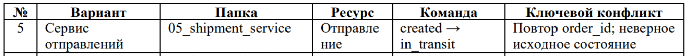
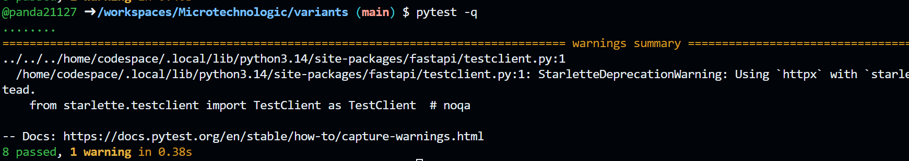
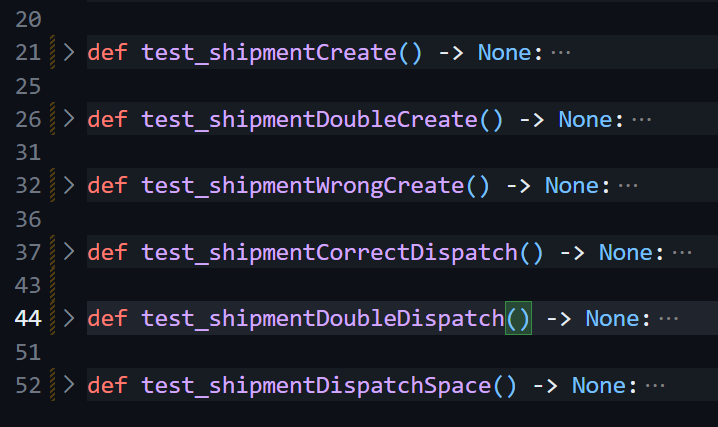

# 1 Лабораторная работа
#### Разработка простого REST-микросервиса по стартовому шаблону
#### Дисциплина: «Микросервисная архитектура»
#### Стек: Python 3.11+, FastAPI, pytest

## Вариант

## Сервис отгрузки

**Цель работы:** разработка простого REST-микросервиса на основе стартового шаблона с использованием FastAPI

**Предметная область:** Каталог отгрузок производственной системы.

**Ресурс:** Shipment: id, order_id, destination, status.

**Операция 1:** создать отгрузку в состоянии created и вернуть 201 Created.

**Операция 2:** опубликовать отгрузку переходом created → in_transit.

**Инварианты:** order_id не должно повторяться; отсутствующая отгрузка дает 404; повторная перевод в состояние отправка запрещена и дает 409.

| Проверка | Запрос | Ожидаемый ответ |
| :---: | :--- | :--- |
| 1 | POST /shipments, корректные order_id и destination | 201; id создан; status=created |
| 2 | Повторный POST /shipments, order_id=0| 418; store не изменен |
| 3 | POST /shipments, destination="555"| 422; store не изменен |
| 4 | POST /shipments/{id}/dispatch для created | 200; status=in_transit |
| 5 | Повторный POST .../dispatch | 409; объект не изменен |
| 6 | POST /products/missing/dispatch | 404 Product not found |

Успешное проведение операций:

Перечент тестов:

## Вывод
В ходе лабораторной работы был успешно разработан REST-микросервис «Сервис каталога» на стеке Python/FastAPI. Обеспечена строгая валидация и корректная обработка ошибок: 422 (некорректные данные), 404 (отсутствующий товар), 409 (повторная публикация) и 418 (произвольный код ошибки для обозначения не возможности создания отгрузки с одним и тем же order_id).